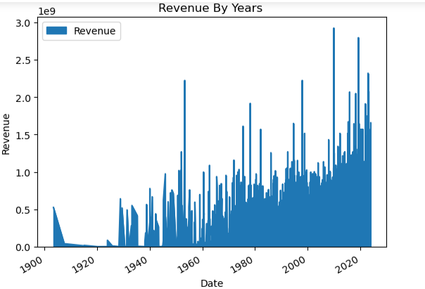
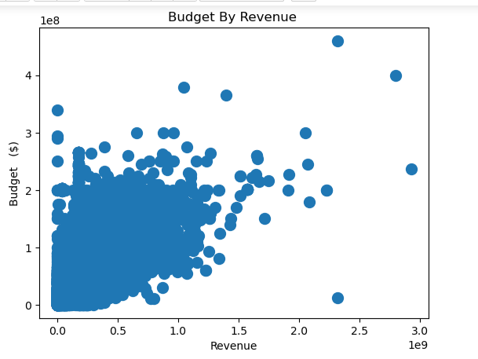
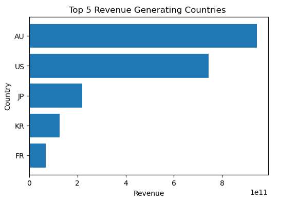
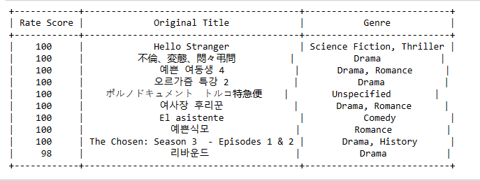
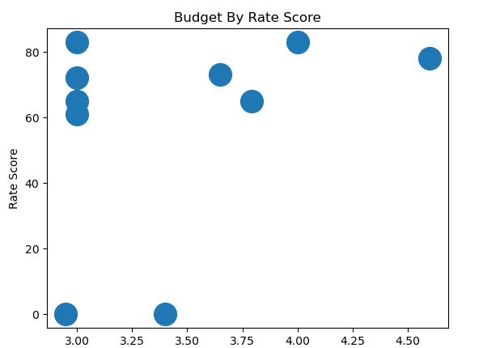

# -Exploring-the-Cinematic-Universe-A-Data-Analysis-of-Movie-Industry-Trends-and-Factors-
# Executive summary
In conclusion, this project provides valuable insights into the movie industry, covering aspects like revenue trends, budget-revenue relationships, country-specific revenue generation, and the impact of budgets on movie ratings. Despite some limitations related to original movie titles in different languages and the presence of outliers, this analysis forms a solid foundation for further research and decision-making in the film industry. Recommendations for future work may include addressing data limitations, exploring international market opportunities, and optimizing budget allocation strategies to maximize revenue and viewer satisfaction.
This project showcases the potential of data analysis in understanding and enhancing the film industry, offering valuable insights for film industry professionals and enthusiasts alike.
# Introduction
The dataset contains information about movies, including their Titles, Release Dates, Imdb Ratings, Meta Score Ratings, Genres, Plot Overviews, Crew Details, Original Titles, Status, Original Languages, Estimated Budgets, Revenue, And Production Countries. It serves as a comprehensive source for analyzing and understanding various aspects of the movie industry. With details about movie attributes, ratings, production information, and more, the dataset can be used for a wide range of analyses and insights. 
This dataset is a valuable resource for film industry analysts, researchers, and enthusiasts, offering a rich array of information to explore trends, preferences, and success factors in the world of cinema. It enables in-depth analyses of movies, their reception, financial aspects, and cultural contexts, making it a versatile tool for various data-driven investigations in the realm of filmmaking. 
# A View Of The Raw Data

# Project Overview
This project was carried out to mark the end of Python tutorial classes and the objectives of the project are: 
1.	Start by loading and examining the dataset. 
2.	Check for missing values, duplicate entries, inconsistent data and other possible Data Issues.
3.	Explore the dataset to gain insights into the movies' characteristics. 
4.	Compute summary statistics, like mean, median, and standard deviation, for variables such as IMDb rating, revenue, budget, and runtime. Create visualizations 
5.	Investigate revenues generated across years for IMDB movies.
6.	What is the relationship between revenue and budget? 
7.	Which country generated the highest revenue in movies? 
8.	What is the highest-rated movie and which genre does it belong to?
9.	Does movie budget affect movie rating? Show this with your analysis.
# Data Source
The data set which was a CSV file was provided in the tutorial learning platform.
# Data cleaning
Incomplete metadata; the column headings had some inconsistencies which were harmonized appropriately using the **.str.title()** function and incomplete headings were replaced with the **.str.replace** function. There were no duplicates however, the **Genre** and **Crew** columns had null values which were replaced with **Unspecified** and **Unknown** respectively using the **.fillna function**.  The data type of a few columns was changed to reflect the data they contained. The null values in the numeric  data were replaced with the**median** value of each column using the **.replace function**. 
# Exploratory Data Analysis EDA
The shape of the dataset revealed that it contained  **10178 rows** and  **12 columns**. The **Genre** and **Crew columns** had **85** and **56 null values** respectively. A few column headings were not correctly spelt. The were no **duplicates** in the entire dataset. The **Revenue** and **Budget** columns had missing values and there were outliers in both columns. Some columns had incorrect **datatype**. 
# Limitations of the analysis
Some movie titles had their original titles in languages such as **Japanese, Chinese** and **Korean** which will not be understood by ordinary English readers without an interpreter. The **outliers** in the dataset were not replaced reason being that they were Budget and Revenue columns and sometimes there could be a significant increase in Budget depending on the economic situation at a time and the Revenue could go beyond forecast. The dataset contained a total of 141 null values and  3 missing values in revenue columns which were all replaced.
# Data Analysis
In the Investigation of the revenues generated across years for IMDB movies, I used an area plot to indicate which year(s) generated the highest and lowest revenues. Area plot is one visualization tool that is ideal for showing trends with dates, times and years. 

The relationship between **Revenue** and **Budget** was established using a scatter plot. A scatter plot is an ideal tool for revealing the correlation between two bi-variant numerical data.

To ascertain the country that generated the highest revenue in movies, I grouped the dataset by the country column and summed up the revenue, then displayed the result of the top five revenue-generating countries using a bar chart.!!

The highest rated movie and their genres were obtained by sorting the Rating Score values in descending order and selecting the top 10 scores, their Original Titles and Genres. The result was displayed in a table. Table visuals are ideal for showing information in rows and columns and for making comparisons of side–by–side comparison of data elements. 

To find out if movie budget affects movie rating, the top ten highest budgets were selected along with the movie rating for each and the result was displayed with a scattered plot.

# Insight
1. The analysis revealed that as the years went by, the revenue generated was on the increase with a slight dropping towards the end of year 2020.
2.  Also, there is a positive correlation between Budget and revenue.
3. Australia generates the highest revenue followed by the United States of America.
4. The Rating Score is 100 and there are nine movies with that score.
5. There is no positive correlation between Budget and Rating Score. 
# Recommendation
1.	**Yearly Revenue Growth Strategy:** Given the increasing revenue trend over the years with a slight drop in 2020, consider further analyzing the causes of the drop in 2020 and develop a growth strategy to maintain or improve revenue in the upcoming years.
2.	**Budget Allocation:** The positive correlation between budget and revenue indicates that increasing the budget for movie production can lead to higher revenue. Consider allocating more resources to projects with revenue potential.
3.	**Market Focus on Australia and the USA:** Focus marketing efforts and distribution strategies on Australia and the United States, as these countries generate the highest revenue. Tailor content or marketing campaigns to the preferences of these markets.
4.	**Leverage High-Rating Movies:** Given that there are nine movies with a perfect rating of 100, leverage these movies for branding and marketing. Consider developing sequels, merchandise, or spin-off content to capitalize on their popularity.
5.	**Quality Over Budget:** While there is no positive correlation between budget and rating score, it's essential to prioritize the quality of the content. Consider investing in scriptwriting, talent, and production values to maintain high-quality content irrespective of budget constraints.
6.	**Analyze 2020 Performance:** Dig deeper into the data to understand why revenue dropped in 2020. Were there external factors, market dynamics, or industry trends that contributed to this decline? Understanding the root causes can help prevent similar issues in the future.
7.	**Market Expansion:** Consider exploring opportunities to expand into other high-revenue markets. Evaluate market potential in countries other than Australia and the USA.
8.	**Diversify Content:** While maintaining quality, consider diversifying your content portfolio to cater to different audience segments and genres. A diverse content library can help capture a broader audience.
9.	**Audience Engagement**: Engage with your audience to understand their preferences and expectations better. Use this information to tailor content and marketing strategies more effectively.
10.	**Data-Driven Decision-Making:** Continue using data analysis to drive decision-making. Regularly monitor revenue, budget, and rating score trends, and be ready to adapt strategies based on new insights and changing market conditions.
These recommendations aim to capitalize on the strengths, address weaknesses, and maximize opportunities based on the findings from your data analysis. It's important to tailor these recommendations to the specific goals and resources of your project or organization.

